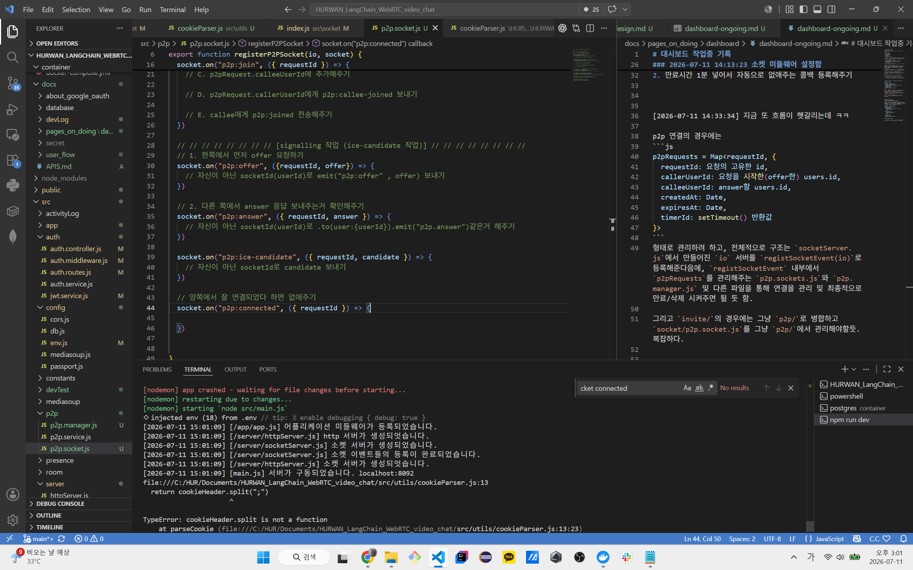
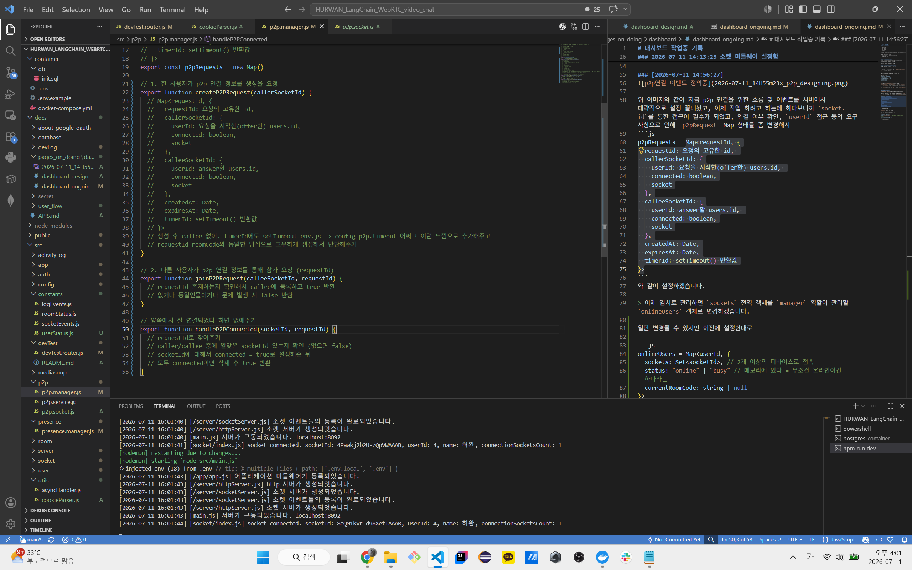

# 대시보드 작업중 기록
### 2026-07-11 13:01:07
일단 클라이언트 소켓 연결은 구현했고, 다음 작업은 6개 이벤트 구현.

1. p2p 방 생성
2. p2p 방 입장
3. group 방 생성
4. group 방 입장
5. 로그아웃
6. invite:recieved 구현 

으로 하려고 하는데 일단 서버쪽에 소켓/mediasoup 구현이 안되어있어서 일단 그쪽 서버 구현하고 작업 이어서 하려고 함.

일단 그러면 서버쪽까지 합치면
1. socket 연결 받기 (쿠키 미들웨어 포함) 구현
2. p2p 방(라우터) 생성 및 비번 제공 및 Map 관리
3. p2p 참여자들 관리

을 해야하는데 감이 안잡히니 일단 만들고 더 고민해보자.

### 2026-07-11 13:35:04 로그 구현
작업을 할 때 socket, mediasoup, room, peer, transport, invite 등 상태는 추적이 어렵기 때문에 `/devTest` api 라우터를 추가하여 이를 postman을 통해 추적 가능하게 만들었습니다.

이후에는 [socket/index.js](../../../src/socket/index.js)를 기반으로 미들웨어를 만들면서 작업을 진행하겠습니다.

### 2026-07-11 14:13:23 소켓 미들웨어 설정함
`socketAccessTokenCheck` 미들웨어 넣긴 했는데 이러면 이제 연결만 문제가 없는거고, 이제 방을 만드는 것부터 해야할듯?

p2p의 경우에는 mediasoup를 사용하는게 아니니까

1. post /p2p/ 같은거 해서 방 코드 생성 + `p2pRequests [privatecode] = ??` 같은거 해줘서 만들어주기
2. 만료시간 1분 넣어서 자동으로 없애주는 콜백 등록해주기


[2026-07-11 14:33:34] 지금 또 흐름이 햇갈리는데 ㅋㅋ

p2p 연결의 경우에는 
```js
p2pRequests = Map<requestId, {
  requestId: 요청의 고유한 id, 
  callerUserId: 요청을 시작한(offer한) users.id, 
  calleeUserId: answer할 users.id,
  createdAt: Date,
  expiresAt: Date,
  timerId: setTimeout() 반환값
}>
```
형태로 관리하려 하고, 전체적으로 구조는 `socketServer.js`에서 만들어진 `io` 서버를 `registSocketEvent(io)`로 등록해준다음에, `registSocketEvent` 내부에서 `p2pRequests`를 관리해주는 `p2p.sockets.js`와 `p2p.manager.js` 및 다른 파일을 통해 연결을 관리 및 최종적으로 만료/삭제 시켜주면 될 듯 함.

그리고 `invite/`의 경우에는 그냥 `p2p/`로 병합하고 `socket/p2p.socket.js`를 그냥 `p2p/`에서 관리해야할듯. 복잡하다.


### [2026-07-11 14:56:27] 


위 이미지와 같이 지금 p2p 연결을 위한 흐름 및 이벤트를 서버에서 대략적으로 설정 끝내놨고, 이제 작업 하려고 하는데 하다보니까 `socket.id`를 통한 접근이 필수가 되었고, 연결 여부 확인, `userId` 접근 등의 요구 사항으로 인해 `p2pRequest` Map 형태를 좀 변경해서 
```js
p2pRequests = Map<requestId, {
  requestId: 요청의 고유한 id, 
  caller: {
    userId: 요청을 시작한(offer한) users.id, 
    connected: boolean,
    socketId
  },
  callee: {
    userId: answer할 users.id, 
    connected: boolean,
    socketId
  },
  createdAt: Date,
  expiresAt: Date,
  timerId: setTimeout() 반환값
}>
```
와 같이 설정하겠습니다.

> 이제 임시로 관리하던 `sockets` 전역 객체를 `manager` 역할이 관리할 `onlineUsers` 객체로 변경하겠습니다.

일단 변경될 수 있지만 이전에 설정한대로

```js
onlineUsers = Map<userId, {
  sockets: Set<socketId>, // 2개 이상의 디바이스로 접속
  status: "online" | "busy" // 메모리에 있다 = 무조건 온라인이긴 하다라는 
  currentRoomCode: string | null
}>
```
와 같이 설정하겠습니다.


### 2026-07-11 16:02:03


> 아직 작업중입니다. ㅋㅋ.... ㅠㅠ. 그래도 이제 함수/이벤트 거의 끝나가고 이제 클라이언트로 연결만 하면 P2P는 끝날 것 같습니다. 또한 onlineUsers manager도 만들어서 이후에 mediasoup 다중 연결도 비교적 금방 될 것 같습니다.

